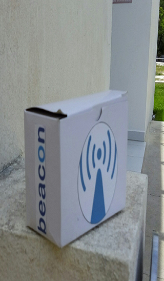

#Beaconmatic’s#

##Definición del proyecto.
  Beaconmatic’s es un proyecto basado en el uso de Beacons para publicidad de establecimientos comerciales.

##¿Que es un beacon? 
  Un beacon es un dispositivo de bajo consumo que emite una señal broadcast, y son suficientemente pequeños para fijarse en una pared o mostradores utiliza conexión bluetooth de bajo consumo (BLE)  para transmitir mensajes o avisos directamente a un dispositivo móvil sin necesidad de una sincronización de los aparatos.

##¿Por qué URL ?

La URL que es el bloque de construcción fundamental de la web, brinda una extraordinaria flexibilidad de expresión. Puede ser:

* Una página web con sólo un pequeño párrafo de la información
* Una página web totalmente interactivo
* Un enlace profundamente en una aplicación nativa

##¿Por qué estamos haciendo esto?

El número de objetos inteligentes va a explotar, tanto en nuestros hogares y en los espacios públicos. Al igual que la web, no va a ser una larga cola de interactividad para los objetos inteligentes. Sin embargo, la sobrecarga de la instalación de una aplicación para cada uno de ellos simplemente no escala. Necesitamos un sistema que le permite caminar y utilizar un dispositivo con sólo un toque. La Web física no se trata de sustituir las aplicaciones nativas; Se trata de permitir la interacción de los momentos en los que las aplicaciones nativas simplemente no son prácticos.

###Como usarlo

#Paso 1
  Se enciende el la flora y modulo bluetooth para activar el beacon ambos son alimentados por una bateria de 3.3V
    

#Paso 2
  Es necesario encernder el Bluetooth en el dispositivo para la comunicacion con la flora.
     

#Paso 3   
  Se abre la aplicacion The Physical Web no es necesario mantenerla abierta puede dejar en segundo plano.
    

#Paso 4
  Cuando el dispositivo pase cerca de un transmisor Beacon este recibira el mensaje al telefono.
    
    
#Paso 5
  Cuando el telefono reciba el beacon se activara una notificacion, al pulsar sobre ella nos abrira la URL.
    

   ###Listo!!!    
   

##Demostracion (Video Promocional)
  
  
[Ver Video](https://youtu.be/8h5rDCZnrlQ)

### Lenguajes de programación :
* Arduino: Usado para la configuracion de la Flora y el modulo Bluetooth. [Ver repositorio](https://github.com/IvanJYL/Beacons/tree/master/PhysicalWeb)
* Java: usado para el desarrollo de la aplicación móvil. [Ver repositorio](https://github.com/IvanJYL/Beacons/tree/master/PhysicalWeb)

### Equipo:
    Ivan De Jesus Yam Lino
    Hector Rodrigo Polanco Balam
